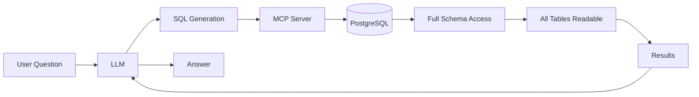
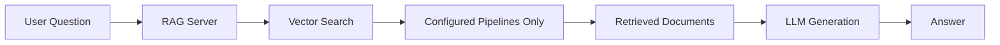

# Choosing the Right Solution

This guide will help you decide between the pgEdge MCP Server (this project) and the [pgEdge RAG Server](https://github.com/pgedge/pgedge-rag-server) for your application.

!!! danger "Critical Security Consideration"
    **The MCP Server should NOT be used in public-facing applications.** When
    connected to an LLM, it provides unrestricted read access to your entire
    database, potentially exposing sensitive implementation details to
    end users.

## Overview

pgEdge offers two complementary approaches for natural language database
interaction:

| Feature | MCP Server | RAG Server |
|---------|------------|------------|
| **Primary Use Case** | Internal tools, development | Public-facing applications |
| **Data Access** | Full database (read-only) | Pre-configured pipelines only |
| **Schema Exposure** | Complete schema visible to LLM | No schema exposure |
| **Query Type** | Natural language to SQL | Semantic search over documents |
| **Integration** | MCP protocol (Claude Desktop, etc.) | REST API |

## Architecture Comparison - MCP Server vs. RAG Server

The following flowcharts highlight the difference between the architecture of an MCP server and a RAG server.

**MCP Server Architecture**

If you use an [MCP server](#when-to-use-an-mcp-server), the LLM has context about your entire schema and can query any table.

**RAG Server Architecture**

If you use a [RAG server](#when-to-use-a-rag-server), the LLM only sees document fragments from pre-approved data sources.

**In comparison:**

| Aspect | MCP Server | RAG Server |
|--------|------------|------------|
| **Trust Level Required** | High (internal users) | Low (public users) |
| **Data Exposure Risk** | High (full schema) | Low (controlled pipelines) |
| **Query Flexibility** | High (any SQL query) | Medium (semantic search) |
| **Setup Complexity** | Low (connect and go) | Medium (configure pipelines) |
| **Best For** | Development, internal tools | Production, public features |

!!! tip "Recommendation"
    For most production applications with external users, you should start with the
    RAG Server. Use an MCP Server for internal development and administrative
    tasks where full database access is appropriate and users are trusted.

## When to Use an MCP Server

The MCP Server is ideal for:

- **Developer tools** - Query databases using natural language during development
- **Internal dashboards** - Business intelligence for trusted employees
- **Database exploration** - Understanding schema and data relationships
- **Administrative tasks** - Monitoring and troubleshooting databases
- **AI-assisted development** - Integration with Claude Desktop or similar tools

An MCP server offers the following advantages:

- Full database exploration capability
- Schema-aware query generation
- System monitoring via PostgreSQL statistics
- Rich tool ecosystem (query, schema analysis, search)
- Direct integration with MCP-compatible clients

### Security Implications of an MCP Server

When the MCP Server is connected to an LLM and exposed to users, the LLM has
the ability to:

- read any table in the connected database.
- explore the complete schema, including table names, column names, data types, and relationships.
- access PostgreSQL system views, revealing server configuration and statistics.
- infer application architecture from naming conventions and table structures.
- find sensitive patterns such as user tables, authentication schemas, or business logic encoded in the data model.

Even with read-only protection, this level of access is inappropriate for public-facing applications where end users could:

- learn implementation details of your application.
- discover internal table structures and column names.
- infer business logic from data relationships.
- find potential attack vectors by understanding your schema.
- access data they shouldn't see through carefully crafted queries.

## When to Use a RAG Server

The [pgEdge RAG Server](https://github.com/pgedge/pgedge-rag-server) is designed for:

- **Customer-facing applications** - Chatbots, help systems, search interfaces
- **Public documentation** - Searchable knowledge bases
- **Product features** - AI-powered search within your application
- **Controlled data access** - Expose only specific content to users

A RAG server offers the following advantages:

- No schema exposure - The LLM only sees document content, not database structure.
- Pipeline-based access - You can pre-configure exactly what data is searchable.
- Hybrid search - You can combine vector similarity with BM25 text matching.
- Token budget control - A RAG server allows you to manage costs with configurable limits.
- Streaming responses - A RAG server provides real-time output via server-sent events.
- Multiple providers - The pgEdge RAG server offers support for OpenAI, Anthropic, Voyage, and Ollama.

The RAG Server uses a fundamentally different approach:

1. Pre-configured pipelines define which tables/columns are searchable.
2. Vector embeddings enable semantic search over document content.
3. Properly configured RAG servers retrieve only relevant documents based on user queries.
4. A RAG server produces answers using only the retrieved context.

The LLM never sees your schema, table names, or raw SQL - it only receives document fragments relevant to the user's question.

## Decision Guide

Choose an MCP Server if:

- your users are developers or trusted internal staff.
- you need full database exploration capabilities.
- you require integration with Claude Desktop or MCP clients.
- schema visibility is acceptable or desired.
- your application runs in a controlled, internal environment.

Choose a RAG Server if:

- your end users are external customers or the general public.
- you need to expose only specific, curated content.
- your schema and implementation details must remain hidden.
- you're building a customer-facing search or chat feature.
- your application requires fine-grained control over accessible data.

Consider using both server types if:

- your developers can use an MCP Server internally for exploration and debugging.
- production customer features can use a RAG Server for controlled access.
- different user populations have different trust levels.

## Related Resources

- [pgEdge RAG Server Documentation](https://docs.pgedge.com/pgedge-rag-server/)
- [Security Guide](security.md) - Security best practices for an MCP server.
- [Authentication Guide](authentication.md) - Access control configuration for an MCP server.
