# Web Client

The pgEdge Natural Language Agent includes a web-based chat interface for
interacting with your PostgreSQL database using natural language queries.

## Logging In

Navigate to the web interface URL (typically `http://localhost:8080` for native
deployments or `http://localhost:8081` for Docker).

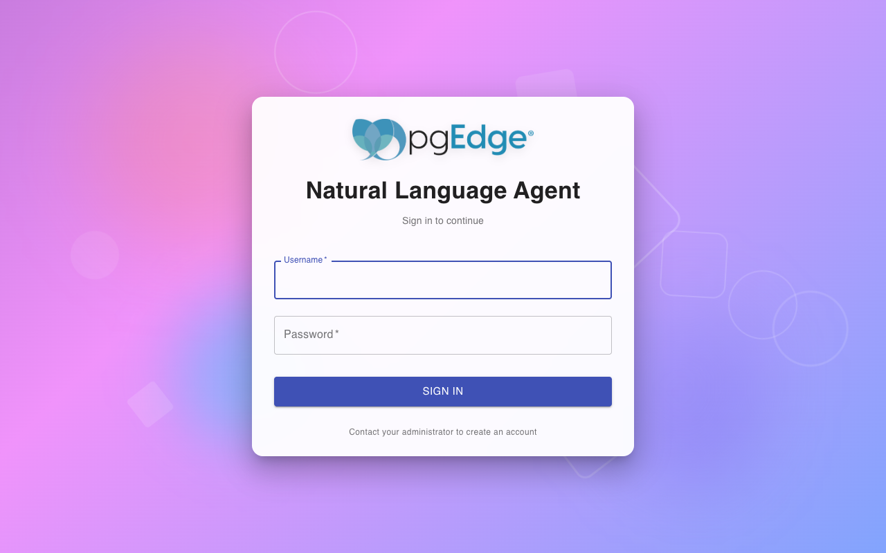

Enter your username and password to access the chat interface. User accounts
are created either:

- Via the `-add-user` command line flag (native deployment)
- Via the `INIT_USERS` environment variable (Docker deployment)

See [Authentication](authentication.md) for details on user management.

## Main Interface

After logging in, you'll see the main chat interface:

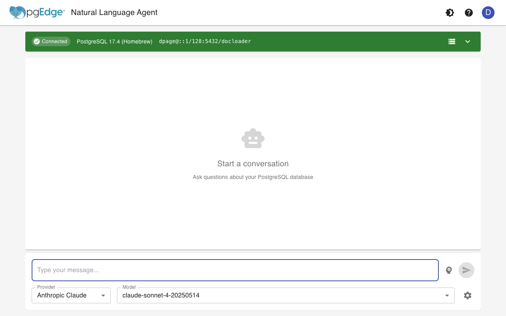

The interface consists of:

- **Header** - Contains the pgEdge logo, theme toggle, help button, and user
  menu
- **Connection Status** - Shows your database connection status (click to
  expand details)
- **Provider/Model Selection** - Choose your LLM provider and model
- **Chat Area** - Displays conversation history
- **Message Input** - Type your natural language queries here

## Selecting a Provider and Model

### Provider Selection

Click the Provider dropdown to choose your LLM provider:

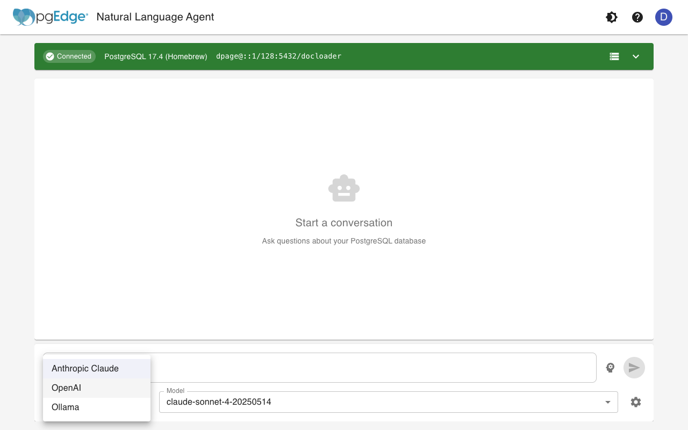

Available providers depend on your server configuration:

- **Anthropic Claude** - Requires `PGEDGE_ANTHROPIC_API_KEY`
- **OpenAI** - Requires `PGEDGE_OPENAI_API_KEY`
- **Ollama** - Requires local Ollama installation

### Model Selection

After selecting a provider, choose a specific model:

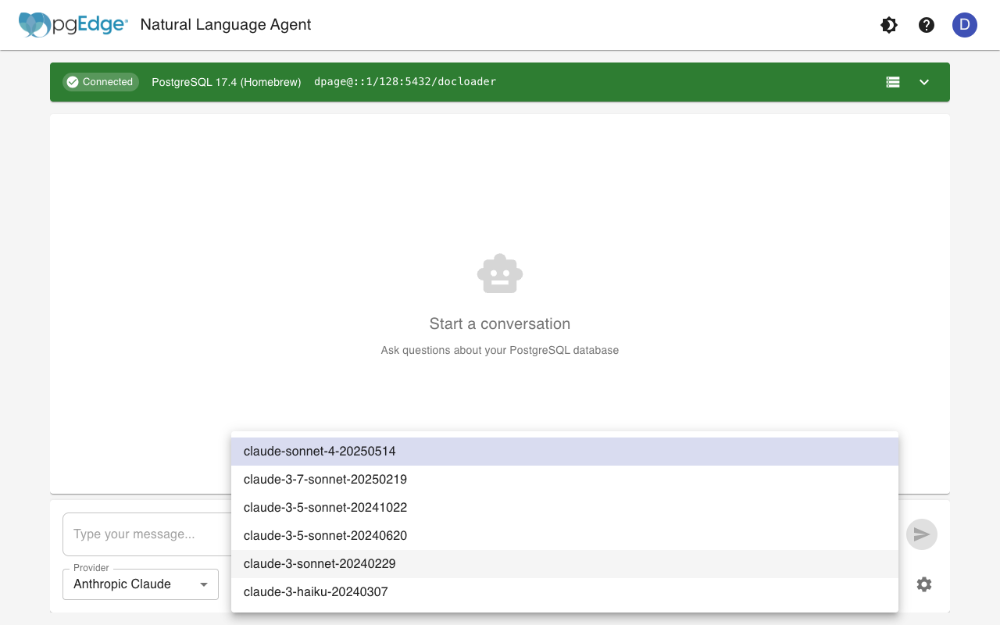

Different models offer varying capabilities and performance characteristics.
See your provider's documentation for model details.

## Querying Your Database

Type a natural language query in the message input and press Enter or click
the send button:

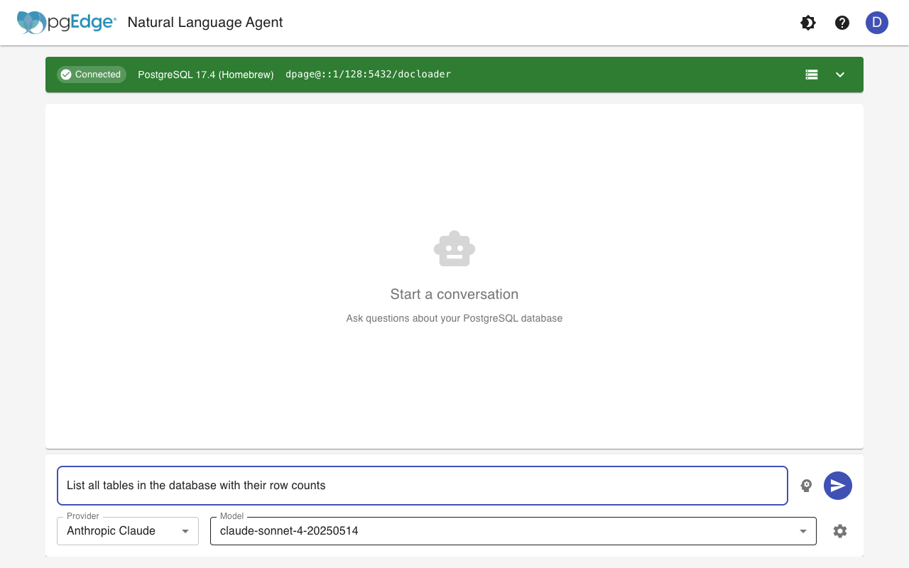

The LLM will analyze your query, interact with your database using the
available tools, and return a response:

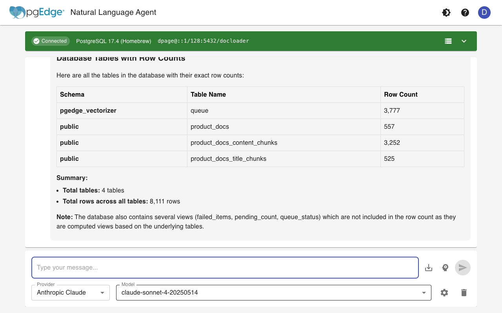

### What You Can Ask

- **Schema exploration** - "What tables are in the database?"
- **Data queries** - "Show me the top 10 customers by order count"
- **Relationships** - "How are the orders and products tables related?"
- **Analysis** - "What's the average order value by month?"
- **Semantic search** - "Find documents about authentication" (requires
  pgEdge Vectorizer)

## Dark Mode

Toggle between light and dark themes using the theme button in the header:


Your theme preference is saved and persists across sessions.

## Getting Help

Click the help icon in the header to open the help panel:

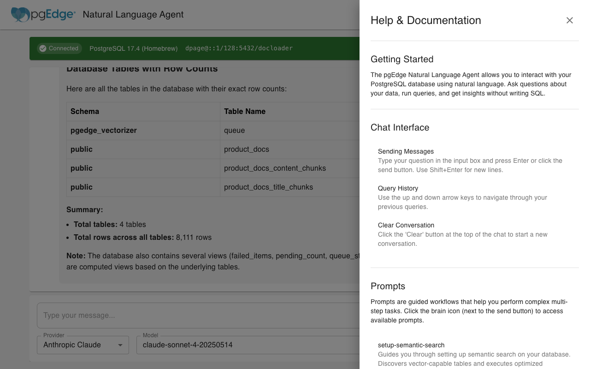

The help panel provides:

- Getting started tips
- Chat interface usage
- Available prompts
- Settings explanations
- Keyboard shortcuts

## Preferences

Click the settings icon (gear) to access preferences:

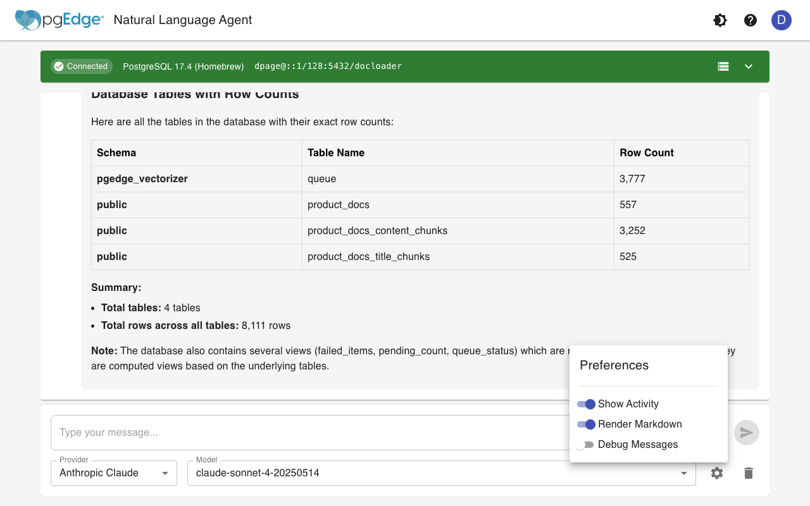

Available options:

- **Show Activity** - Display tool calls and resource reads in the
  conversation
- **Render Markdown** - Format responses with markdown styling
- **Debug Messages** - Show system-level debug information

Preferences are saved locally and persist across sessions.

## Using Prompts

Prompts are guided workflows for common tasks. Click the brain icon next to
the message input to access them:

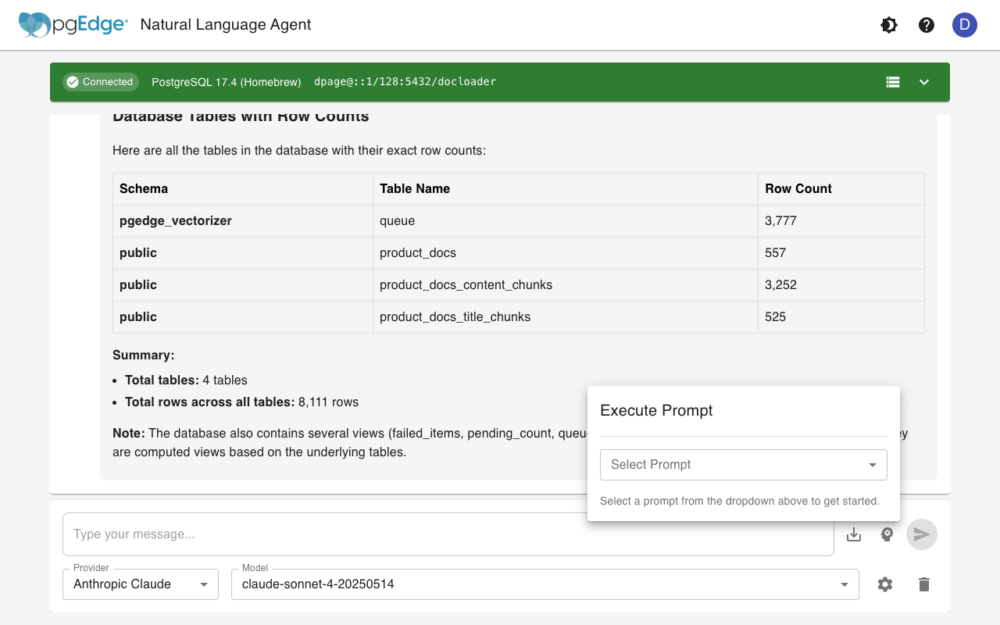

### Selecting a Prompt

Open the prompt dropdown to see available prompts:

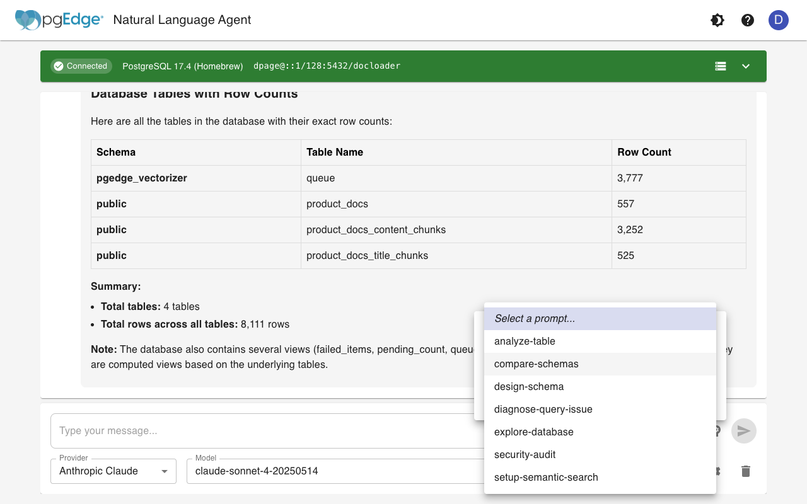

### Configuring Arguments

Some prompts require arguments. Fill in the required fields:

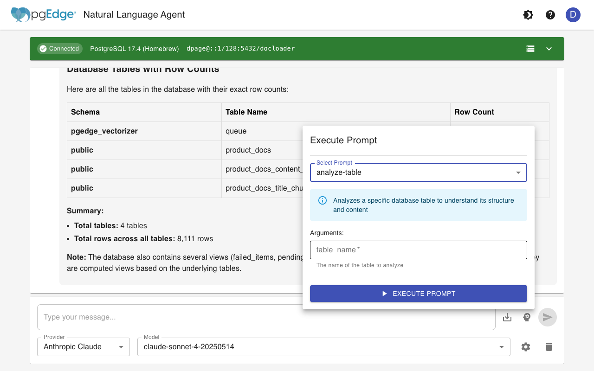

Click "Execute Prompt" to run the workflow. The LLM will follow the prompt's
guided steps to complete the task.

### Available Prompts

| Prompt | Description |
|--------|-------------|
| `explore-database` | Systematically explore database structure |
| `setup-semantic-search` | Configure semantic search on vector tables |
| `diagnose-query-issue` | Debug problems with queries |

See [Prompts Reference](../reference/prompts.md) for complete documentation.

## User Menu

Click your avatar in the header to access the user menu:

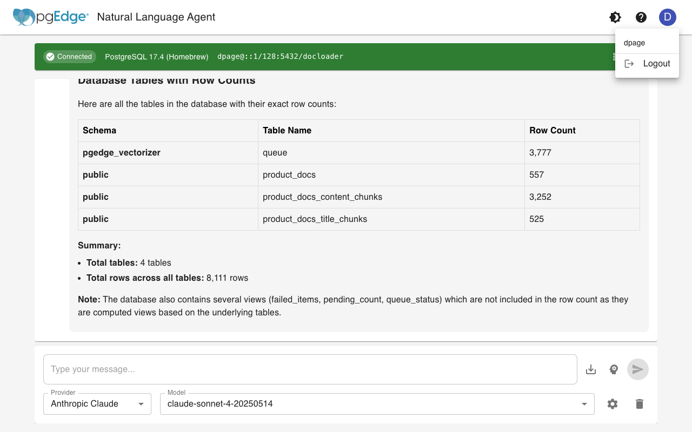

Options include:

- View current username
- Log out

## Keyboard Shortcuts

| Shortcut | Action |
|----------|--------|
| `Enter` | Send message |
| `Shift+Enter` | New line in message |
| `↑` / `↓` | Navigate query history |
| `Escape` | Close dialogs/panels |

## Saving Conversations

Click the download icon next to the message input to export your conversation
as a Markdown file. This is useful for:

- Documenting database exploration sessions
- Sharing query results with team members
- Keeping records of analysis work

## Conversation History

The web client automatically saves your conversations to the server, allowing
you to access them across different browsers and sessions. This feature
requires authentication to be enabled.

### Accessing Conversation History

Click the tab button (>) on the left edge of the screen, below the header, to
open the conversation panel. The button changes to (<) when the panel is open.
The conversation panel shows:

- **New Conversation** button - Start a fresh conversation
- **Conversation list** - Your previous conversations, sorted by most recent
- **Delete All** button - Remove all conversations

### Managing Conversations

Each conversation in the list shows:

- The conversation title (based on your first message)
- When it was last updated (e.g., "2h ago", "Yesterday")

Hover over a conversation to reveal action buttons:

- **Edit icon** - Rename the conversation
- **Delete icon** - Delete the conversation

### Loading a Conversation

Click on any conversation in the list to load it. When you load a previous
conversation:

- All messages are restored to the chat interface
- The LLM provider and model are restored to what you were using
- You can continue the conversation from where you left off

### Renaming Conversations

To give a conversation a more descriptive name:

1. Hover over the conversation in the list
2. Click the edit (pencil) icon
3. Enter the new title in the dialog
4. Click "Rename" or press Enter

### Auto-Save Behavior

Conversations are automatically saved when:

- A new conversation receives its first assistant response
- You continue an existing conversation

The provider and model you're using are also saved, so when you reload a
conversation, it automatically switches to the same LLM configuration.

### Data Storage

Conversation data is stored in a SQLite database on the server. By default,
this is located at `{binary_dir}/data/conversations.db`. You can customize
the location using the `data_dir` configuration option:

```yaml
# In pgedge-mcp-server.yaml
data_dir: "/var/lib/pgedge/data"
```

Or via environment variable:

```bash
export PGEDGE_DATA_DIR="/var/lib/pgedge/data"
```

### Privacy and Security

- Each user can only see their own conversations
- Conversations are stored per-username on the server
- Deleting a conversation permanently removes it from the database

## Tips for Effective Queries

1. **Be specific** - "Show customers from California" works better than
   "Show some customers"

2. **Reference tables by name** - If you know the table name, include it:
   "Query the orders table for last month's sales"

3. **Ask follow-up questions** - The LLM maintains conversation context, so
   you can refine queries: "Now filter that to only show orders over $100"

4. **Use prompts for complex tasks** - For multi-step operations like setting
   up semantic search, use the built-in prompts

5. **Check activity** - Enable "Show Activity" in preferences to see which
   tools and resources the LLM is using

## Troubleshooting

### Connection Issues

If you see a red connection indicator:

1. Check that the MCP server is running
2. Verify database credentials in the server configuration
3. Check network connectivity to the database host

### Slow Responses

- Try a faster model (e.g., `claude-sonnet` instead of `claude-opus`)
- Enable response streaming in server configuration
- Check your LLM provider's rate limits

### Authentication Errors

- Verify your username and password
- Check that the user exists (use `-list-users` on the server)
- Ensure authentication is enabled in server configuration

See [Troubleshooting](troubleshooting.md) for more help.
