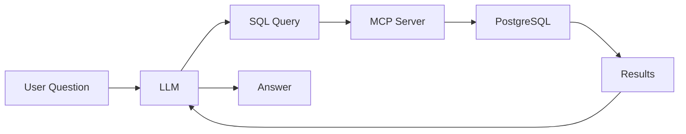

# pgEdge Natural Language Agent

The pgEdge Natural Language Agent enables a Model Context Protocol (MCP) server that allows you to use natural language queries when interacting with a Postgres database.

!!! warning "Pre-Release"
    This software is in pre-release status. Test thoroughly before production use.

!!! danger "Not for Public-Facing Applications"
    This MCP server provides LLMs with read access to your entire database
    schema and data. It should only be used for internal tools, developer
    workflows, or environments where all users are trusted. For public-facing
    applications, consider using the
    [pgEdge RAG Server](https://github.com/pgedge/pgedge-rag-server) instead.
    **[Read the full comparison →](guide/mcp-vs-rag.md)**

**MCP Server Features**

- **Natural Language to SQL** - Ask questions in plain English
- **Read-Only Protection** - All queries execute in read-only transactions
- **Multiple LLM Support** - Anthropic Claude, OpenAI, or Ollama (local/free)
- **Web Interface** - Modern React-based chat UI
- **CLI Client** - Production chat client with Anthropic prompt caching
- **Secure** - TLS, token/user authentication, read-only enforcement

How the MCP server works:

1. **Schema extraction** - The server loads table/column metadata from PostgreSQL.
2. **Query generation** - The LLM converts natural language to SQL.
3. **Safe execution** - Queries run in read-only transactions.
4. **Result formatting** - Answers are returned to the user.

## User Guide

For server operators and end users:

- [Choosing the Right Solution](guide/mcp-vs-rag.md) - MCP Server vs RAG Server
- [Deployment](guide/deployment.md) - Docker, native, and systemd deployment
- [Configuration](guide/configuration.md) - All configuration options
- [Authentication](guide/authentication.md) - Users, tokens, and access control
- [CLI Client](guide/cli-client.md) - Command-line interface
- [Security](guide/security.md) - Security best practices
- [Troubleshooting](guide/troubleshooting.md) - Common issues and solutions

Reference Pages:

- [Tools](reference/tools.md) - Database query, schema, search tools
- [Resources](reference/resources.md) - System info and schema resources
- [Prompts](reference/prompts.md) - Guided workflow prompts
- [Examples](reference/examples.md) - Query examples

For Developers building applications that use the MCP server:

- [Overview](developers/overview.md) - Integration approaches
- [MCP Protocol](developers/mcp-protocol.md) - Protocol details
- [API Reference](developers/api-reference.md) - HTTP endpoints
- [Building Chat Clients](developers/building-chat-clients.md) - Client development

Advanced Topics:

- [Custom Prompts & Resources](advanced/custom-definitions.md) - Extend functionality
- [Knowledgebase](advanced/knowledgebase.md) - Documentation search system
- [LLM Proxy](advanced/llm-proxy.md) - Server-side LLM integration

For project contributors:

- [Development Setup](contributing/development.md) - Local development
- [Architecture](contributing/architecture.md) - System design
- [Testing](contributing/testing.md) - Test suites
- [CI/CD](contributing/ci-cd.md) - Automation pipelines

## License

This project is licensed under the [PostgreSQL License](LICENCE.md).